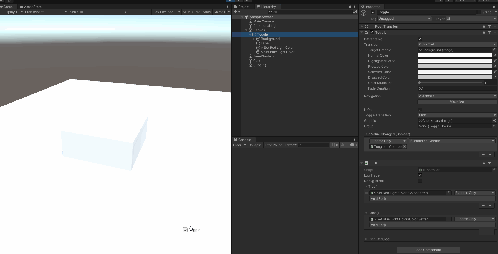

# Chain Behaviors

A set of components allowing to make common operations via generic components instead of rewriting little specific scripts.

[Changelog](Documentation~/Changelog.md)

## Dependencies

*Minimum version Unity required: 2019.3*

- [UniTask](https://github.com/Cysharp/UniTask) (Required)
- [App Tools](https://gitea.apperture.fr:3062/Apperture/app-tools) (Required)
- [Adv Unity Event](https://gitea.apperture.fr:3062/Apperture/adv-unity-event) (Required)
- [ScriptableObject Architecture](https://intra.persistant.fr:3000/Apperture/scriptableobject-architecture) (Optional)
- [SO Architecture Extras](https://intra.persistant.fr:3000/Apperture/so-architecture-extras) (Optional)

## Concept

The main concept to catch behind the Chain Behaviors is that each component make a little task and forward its result (or not) to another component to make a chain of behavior to execute.



In this example, we have:

* Toggle: when click the toggle, it trigger the `OnValueChanged` event and send its result to a `If` behavior.
  * `If`: just split a bool value to 2 distinct events. Here, it makes 2 different call according to the toggle being switch on or off.
    * If on, call "> Set Red Light Color": the `Color Setter` behavior task is to trigger an event with the associated color. In our case, red.
    * If off, call "> Set Blue Light Color": the `Color Setter` will then trigger an event with the blue color.
      * The `Color Setter`,via the event, will change the light color.

This is a simple example but we can go way more complex! So it is also important to stay clear!

You may also want to be careful about the number of GameObjects you are going to create since it can grow pretty fast and make your scene heavier.

---

## Features

- (Almost) all chain behaviors have a "Log Trace", allowing to display that a method has been called (and can provide details about the call and arguments used).

  **You must add `CHAINBEHAVIOR_METHOD_TRACE` to your Scripting Define Symbols to enable log. Remove it if you want to remove these method calls to save performance.**

- "Debug Break" allows to break when Visual Studio is attached. Just goes up in the stacktrace pile to get more details on what's happening on a specific behavior.

### Behaviors

* Animation
  * `AnimatorClipPlayer`: Allow to play a specific clip on an Animator
  * `SetAnimatorParameter`: Provide a way to feed an Animator parameter via "Submit*" methods
  
* Audio
  * `AudioClipWaveformVisualizer`: Generate a texture representing an `AudioClip` waveform
  * `AudioListenerCaptureController`: Capture the audio from an `AudioListener` in a file
  * `AudioAmplitudesToWavData`: Convert audio raw samples (float[]) to WAV data (byte[])
  * `AudioSamplesToWavData`: Convert audio samples file to WAV data
  * `PrependWaveHeader`: Prepend WAV header to some WAV data so the WAV structure is completed
  
* Controls
  * Branch
    * `If`
    * `Int Selector`: trigger an event according to the int value entry
    * `Numeric Condition`: check a numeric condition on 2 floats
    * `Toggle Gate Controller`: act as a gate. If opened, the event can be executed, otherwise nothing happens
    * `Validity Checker`: check an object is valid (null). Unity Objects are supported.
  * `Caster`: cast an type in another (Odin is required)
  * `Color Setter`: trigger an event with a color
  * `Delay`: trigger an event after X seconds
  * `Gradient Color Setter`: trigger an event with a color from a gradient color, according to the normalized value passed as argument
  * `Instance Synchronizator`: instantiates a prefab attached to a GameObject. Not really a behavior, more than an utility class.
  * `Once Per Application Run`: trigger an event only once in an application run
  
* EventCom: use `EventListener` and `EventNotifier` to setup an event communication system.

  * `EventListener`: listen a `Event Notifier`
  * `EventNotifier`: allow to trigger an event that will be forwarded to subscribed `EventListener`s

* Events

  * `MonoBehaviorLifeCycleEvents`: triggers common MonoBehavior events (like `Start`, `OnEnable`, `OnDestroy` etc.). (better with Odin Inspector)

* Extractors: their specialization is to extract data from a data source and forward its results with an event.

  * `ExtractAudioClipName`: forward the clip name of an `AudioClip`. Useful to display audio title in a UI.

* Filters: triggers event if the value passes the filter

  * `GameObjectFilter`
  * `ObjectHandleFilter`: really useful when using `ObjectHandle` as enum

* GameObjects

  * `GameObjectsEnableController`: enable/disable easily several GameObjects from a bool. Make it easy to toggle GameObjects.
  * `GameObjectSwitcher`: enable/disable GameObject child according to an index. Only one child can be activated. Useful to make a tab system in UI.

* Image

  * `Texture2DEncoder`: encode a `Texture2D` as `byte[]` (jpg, png etc.). Combine with `ByteBufferToFile` to save it as a file.
  * `Texure2DToSprite`: convert a `Texture2D` to a `Sprite`

* Graphics
  
  * `Graphics Settings Controller`: allow to change graphics settings
  
* IO
  * `Byte Buffer To File`: save a byte[] to a file
  * `Directory Deleter`
  * `File Stream Creator`
  * `Object To Asset`: save a `UnityEngine.Object` as an asset (editor only)
  
* Localization

  * `LocalizationController`: allow to act on the Localization system (like changing localization culture)
  * `LocalizedStringSetter`: forward a `LocalizedString` set. If `LocalizedString` is empty, another event is raised, allowing to update UI in consequence for example.
  * `LocalizeStringAccessor`: provide a way to get the resulting string of a `LocalizeStringEvent`
  * `LocalizeStringArgumentSetter`: set an argument to a `LocalizedString`
  * Smart String
    * `SmartStringFormatter`: allow to format string from values sources, using power of SmartStrings


* Math

  * Mathematic operations : make simple calculus (+, -, *, /, %) between 2 values. Values can be dynamics, constants or both (most of the time).
    * `MathFloatOperation`: float version
    * `MathIntOperation`: int version
  * `FloatRemapper`: remap a float value from a range to another one.
  * `FloatStepIndexer`: tell which threshold (index) has been reached by a floating value.
  * `FloatThreshold`: triggers events according to a floating value reaching some thresholds.
  * `MathClampOperation`: allow to clamp int and float values.

* Microphone
  
  * `Microphone Capture Controller`: record the microphone and save it to a file
  
* Miscs

  * `UnityEngineApplicationInterface`: allow to act on `UnityEngine.Application`.

* Mutators

  * `TextMutator`: applies modifications on a string. Useful to truncate a string for example.
  * `TransformMutator`: applies modifications on a `Transform`.
  * `ColorAlphaMutator`: set the alpha of a color

* Observers

  * `AudioSourceStateObserver`: observes the play state changes in an `AudioSource`
  * `CollisionEventsObserver`: notifies trigger and collision events

* Processors

  * `ProcessorsController`: run a list of processes.
  * Processes
    * `CameraPlaneAttachProcess`: move and scale a plane transform so its match the camera near/far plane at the desired distance.
    * `ExtractAudioClipTimeProcess`: really useful to make a progress bar (with a slider) for an audio being played.
    * `GenericUpdateProcess`: forward an update (passing by the delta time). Can be used to interact with more native behaviors.
    * `TargetFramerateUpdateProcess`: execute event at a specific framerate
    * `TargetTimeIntervalUpdateProcess`: execute event each interval seconds
    * `TransformModifierProcess`: applies transform modification each frame.

* Proxies
  * Events: they allow to forward or group events calls. They are mainly used to put things in order or convert a `UnityEvent` to an `AUEEvent`
  * UnityObjectProxy: allow to bind a GameObject as a direct reference or from a prefab
  
* RefCounterController

  * `RefCounterController`: keep reference count and trigger event in consequences. Useful when multiple sources try to act on the same thing. For example, you have 2 toggles that enable one GameObject. If one is turned off, you would like to keep the GameObject enabled since it still has 1 toggle enabled (ref count = 1). Turning off the last toggle will set ref count = 0 and so the adapted event will be notified in consequence.

* Text

  * `Printer`: log a value or a message. Useful to display debug values or trace.

    If you need to check if a button click has really been performed, just call `Printer.Log` to ensure it!

  * `ValueFormatterController`: create a string from the value applied on a specific format
  * `StringKeeper`: hold a string. Useful to keep the result of a `LocalizeStringEvent`
and re-use it later.

* UI

  * `PointerInteractableArea`: forward UI events (onPointerEnter, onPointerMove etc.)
  * Processes:
    * `ScrollableLoopUI`: make an infinite scroll loop on a horizontal or vertical layout.

* XR
  
  * `VR Mode Watcher`: at start, trigger an event telling if VR is enabled.

---

## Extends ChainBehaviors

* Create a new script and inherit from `BaseMethod`
* Do you what you want

### Logs

**You must add `CHAINBEHAVIOR_METHOD_TRACE` to your Scripting Define Symbols to enable log. Remove it if you want to remove these method calls to save performance.**

Inheriting from `BaseMethod` allows to use `Trace` and `TraceCustomMethodName` in your own behavior.

* `Trace`: log  `{GameObject Name}({Behavior name})` and optional details like arguments. You may want to use it when your behavior has only one method.
* `TraceCustomMethodName`: log `{GameObject Name}({Behavior name}):{Custom Method Name}` and optional details like arguments. You may want to use it when you have several method than can be called and want to precise which method has been called.

```csharp
Trace();
Trace(("value", value));
Trace(("key", key),
     ("value", value));

TraceCustomMethodName("MyCustomMethod");
TraceCustomMethodName("MyCustomMethod", ("key", key), ("value", value), ("target", myGameObject));
```

*Note that `UnityEngine.Object` passed as argument generate an hyperlink in editor so you can just click on it from the console to ping it.*